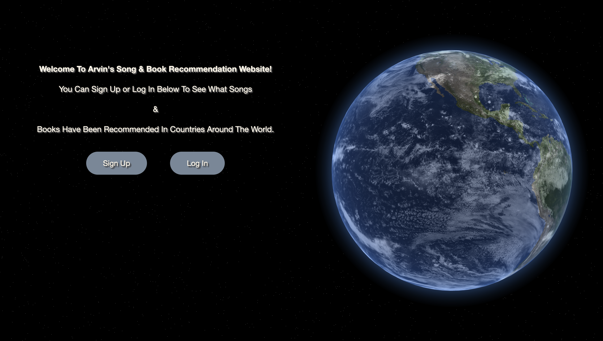
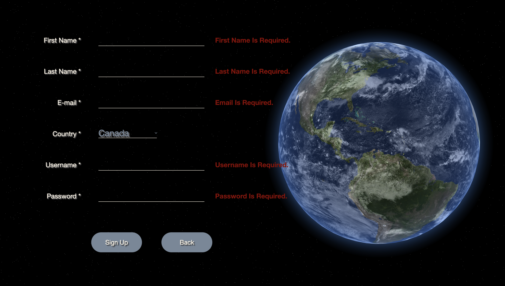
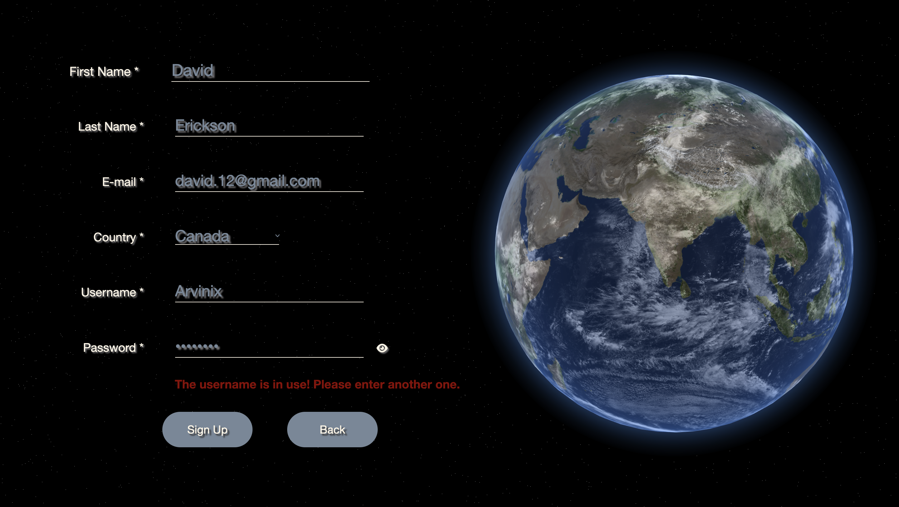
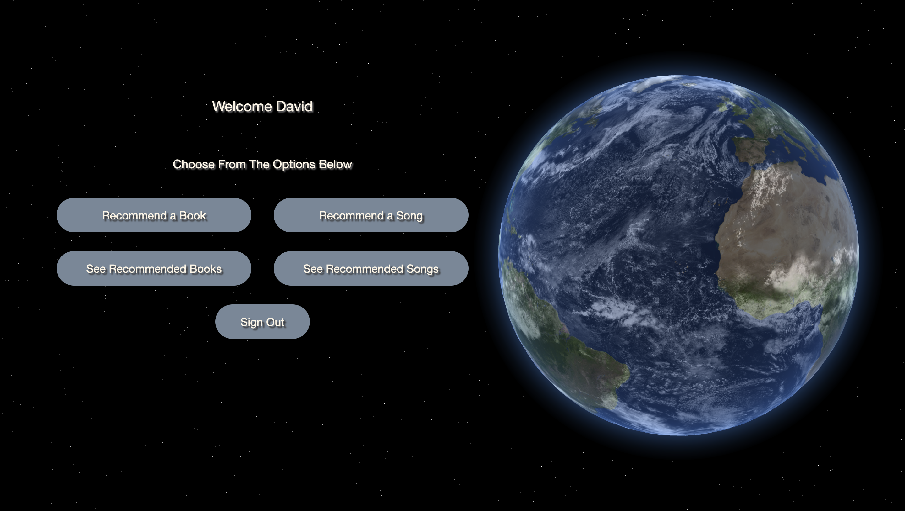
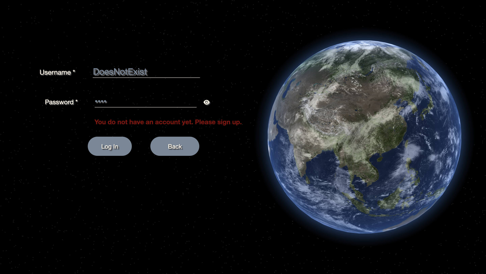
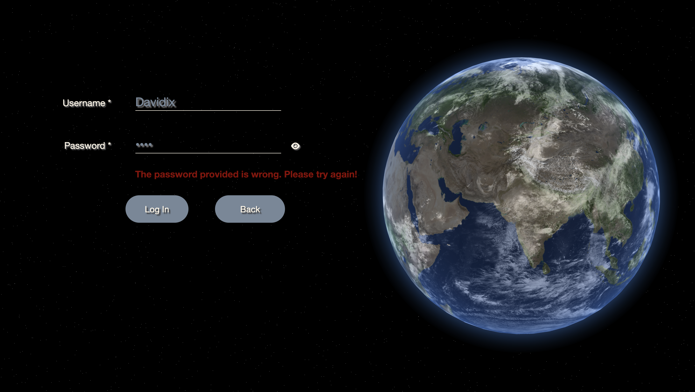
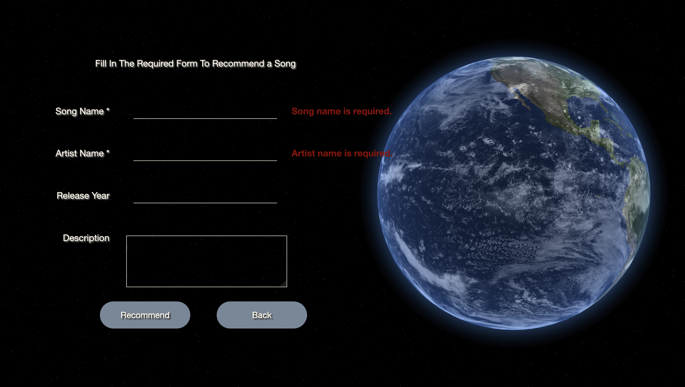
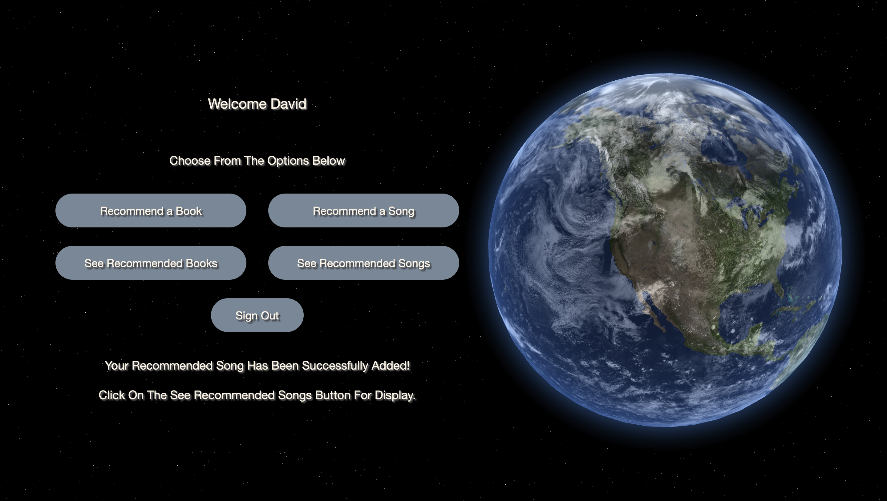
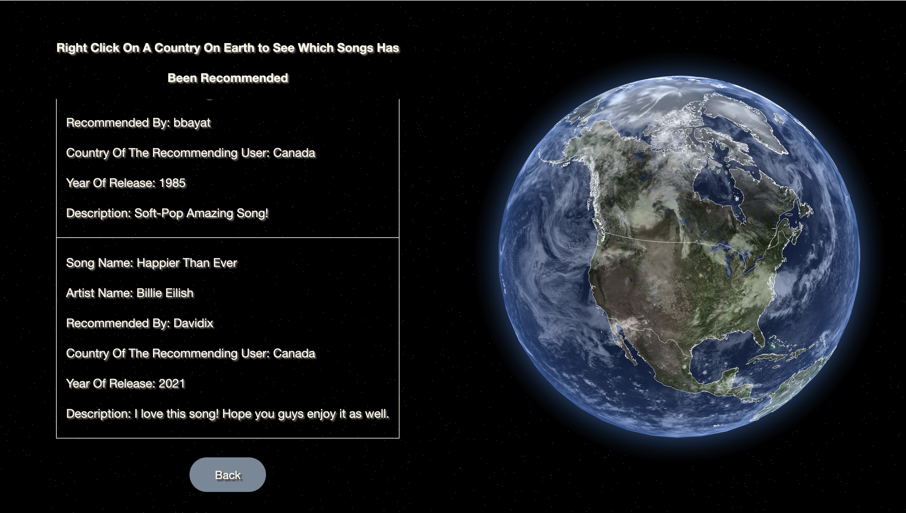
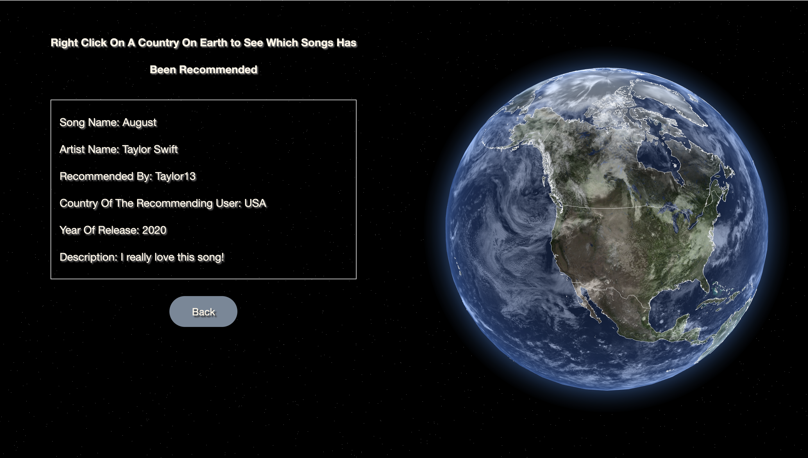

## Introduction

Welcome to my interactive web application! This platform allows you to signup, log in, and recommend songs and books to your friends and even strangers. It also allows ypu to see which songs or books are recommended in different countries.

## How To Run The Program
- Enter the command **"node server.js"** on the terminal to launch a local server and open the port in **Firefox** or **Opera**.

## Project Dependencies
- **Node.js:** Ensure that Node.js is installed on your system to run the program.

## Currently Available Countries When Signing Up
- **Canada**
- **United States**
- **Mexico**

## Notes About The Background Stars
- Currently, this application can be run on **Firefox** and **Opera** due to the custom fragment and vertex shaders which define the background stars.
- The rendering of background stars may experience limitations when the graphics processing unit (GPU) within your computer is of an older model.

## How to Interact With The Graphics

I've incorporated an interactive feature into the application - an Earth set in space, which enhances the visual appeal of the platform and improves the user interface.

**In All Web Pages:**

- You can left-click and drag the Earth to rotate it, and to navigate different territories on earth.

**After clicking on "See Recommended Books" or "See Recommended Songs":**

- Once the white borders of the countries become visible, right-click on any of the available countries to generate a table displaying the recommended songs or books for that region.

## How to Navigate & Use the Web Application

### Signing Up:
    
If you're new here, sign up to create an account and start exploring the platform's features.
   - Fields which include an asterisk are required. If you try to sign up before providing the required information, you will be informed that you must do so.
   
     

   - If you enter a username which is in use, you will be informed that you can't use that specific username and are asked to choose another one.

     

   - You can toggle the visibility of the password field by clicking on the eye icon located next to it, switching between obscured (secret) and visible (non-secret) modes.

   - Finally, after providing all the required information you are logged in after clicking on the signup button!

     

### Logging In:

Already have an account? Log in to access your profile and personalized recommendations.
  - If you enter a username that does not exist and try to log in, you will be informed that you are not signed up in this web application and are asked to creat an account.

    

  - If the username you provided exists, but the password is incorrect; you will be informed that the password for that specific username is wrong and are asked to enter the correct password.

    

  - Similar to the signup page, you can toggle the visibility of the password field by clicking on the eye icon located next to it, switching between obscured (secret) and visible (non-secret) modes.

### Recommending a Book or a Song:

Once logged in, head over to the "Recommend a Song" or "Recommend a Book" page to share your current favorite song or book with others.
   - After choosing one of the pages, you can fill the required fields to recommend a book or a song.

   - If you click on the recommend button before providing an input for the required fields, you will be informed to do so.

     

   - Once you provided all the required information click on the recommend button. You will automatically re-directed to the decision page and you will be informed that your recommend song or book has been saved.

     

### See Which Songs & Books Are Recommended:

After recommending your favorites, or if you're curious about what others are recommending, visit the respective pages to see the recommendations.
   - **See Recommended Song:** Explore the recommended songs and discover new tracks.
   - **Book Recommended Books:** Check out the recommended books and add new titles to your reading list.
   - **Earth Interaction:** Right click on one of the available countries to see its recommendations. Once you enter in one of the above web pages it might take a few seconds for the white country borders to be visible.
     1. Right click on one of the available country to see its recommendations. 
     2. For example below in the "See Recommended Songs" page, I found Canada on the globe and right-clicked on it. As you can see a table of all the songs that has been recommended is generated. You can see the song David has recommended!
   
        
     
     3. You can further click on other countries to see which songs has been recommended in those respective countries. For instance, below I clicked on the United States. As a result, the song that was recommended by a user in US is shown.
     
        
   
